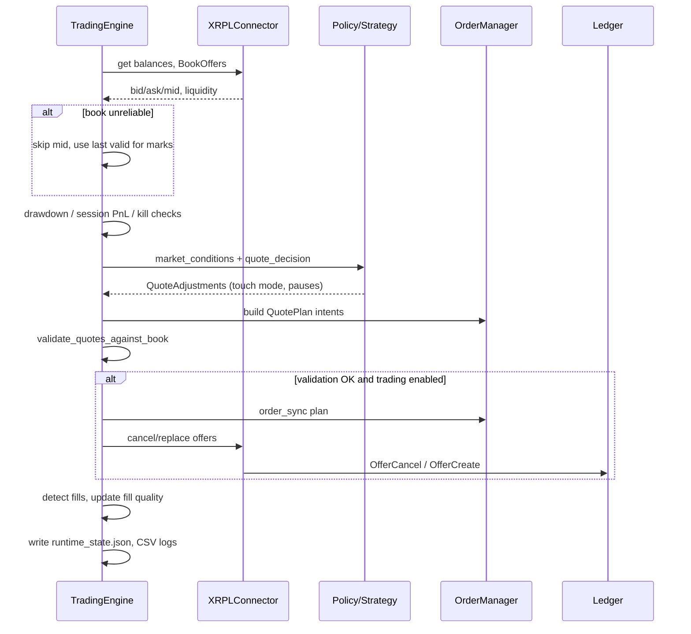

# How XLedgerMate works — evaluation & improvements

**Version:** 1.4.4 (`tier-2-polish`)  
**Pair:** XRP / RLUSD on XRPL  
**Capital model:** Dedicated bot wallet (“risk capital”); main holdings intentionally isolated

---

## 1. What the bot actually does (plain language)

XLedgerMate is an **automated quote manager** for the XRPL decentralized order book. It does not run on a centralized exchange API. It:

1. Reads your bot account balances (XRP + RLUSD trust line).
2. Pulls the **XRP/RLUSD order book** from XRPL JSON-RPC.
3. Estimates **mid price**, volatility, liquidity, and whether the book is trustworthy.
4. Chooses a **profile** (`safe`, `tight_spread`, etc.) that sets aggression, spread floors, toxicity limits, and refresh cadence.
5. Builds **layered bid/ask offers** (L1–L3) with inventory skew, momentum defense, and fill-quality feedback.
6. **Validates** quotes against the live touch before submitting.
7. **Syncs** open offers (cancel/replace only when needed) to preserve queue when possible.
8. Detects **fills** via ledger transactions and balance deltas; scores toxicity via markout.
9. **Stops** quoting when kill switches fire (drawdown, toxic streak, spread failures, session loss, RPC errors).

The Streamlit GUI is the **control plane**: start/stop engine, change profile, sync risk capital to wallet, inspect session PnL and decisions.

It is **not** high-frequency trading. A typical cycle sleeps **15–60 seconds** between book polls (profile-dependent).

---

## 2. End-to-end cycle (one engine iteration)



### 2.1 Spread formation (not classic Avellaneda)

```
effective_spread[level] =
  f(base_spread, level_increment, volatility_pct, liquidity_score, profile.multipliers)
```

Profiles apply multipliers and **minimum spread floors** (e.g. `safe` floor ~0.16%). Volatility widens; thin liquidity widens. This is a **transparent rules engine**, not an optimal control solution to the A-S PDE.

### 2.2 Dynamic quoting policy (the “brain”)

`core/dynamic_quoting_policy.py` maps live conditions to one of:

| Posture | Meaning |
|---------|---------|
| `at_touch` | Compete at best bid/ask (within caps) |
| `near_touch` | Slightly behind touch |
| `spread_mid` | Quote toward mid — less adverse selection risk |
| `off` | Defensive — avoid being picked off |

Inputs: profile bounds, market assessment (favorable/neutral/defensive/hostile), book spread tightness, toxicity ratio, momentum, fill-quality score.

**Why `safe` often shows 0 offers:** Hostile/thin/toxic conditions push posture to `off` or pause sides — by design for capital preservation, not for maximum fill rate.

### 2.3 Inventory and defense

- Target ~**55% XRP** (configurable).
- Skew widens the overweight side, shrinks size, may pause a side past deviation thresholds.
- **Rebalance mode** vs **market_make mode** changes how aggressively it leans back to target.

### 2.4 Kill switch stack (defense in depth)

| Trigger | Typical default | Purpose |
|---------|-----------------|---------|
| Daily drawdown % | ~3.5% | Portfolio mark vs day start |
| Spread validation failures | consecutive streak | Quotes dangerously off book |
| Toxic fill ratio | optional / refresh pause | Adverse selection |
| Session balance loss | −0.35 XRP after 25 fills | Wallet bleed guard |
| RPC errors | streak | Node health |
| Invalid mid | skip mark, no false kill | v1.4.2+ |

After kill: operator clears in GUI/CLI, **must restart engine** to reset session baselines.

---

## 3. Evaluation — what works well

### 3.1 Operator-first design ✅

- Clear separation of bot wallet vs main bag (documented in code comments and manuals).
- GUI shows session insights, toxic labels, policy line on ticker, engine restart.
- Credential sidecar prevents accidental wipe on save.
- Scripts for weekly skim and portfolio bleed analysis.

### 3.2 Mainnet pilot evidence ✅ (Gate 1)

Per your `IMPLEMENTATION_PLAN.md` and changelog:

- ~80-fill reference session with **+0.41 XRP** logged spread capture.
- Plumbing proven: offers, fills, kills, ledger sync.
- False drawdown on crossed book **fixed** (v1.4.2–1.4.3).
- Spread-fail kill no longer trips on bad feed alone (v1.4.4).

This validates **“it can run without blowing up on bad data”** — the right bar for Gate 1.

### 3.3 Engineering maturity ✅

- 140 automated tests on critical paths.
- Unified quoting policy (post v1.4.1 audit).
- Selective order refresh and `cancel_per_fill` metric — right direction for XRPL queue economics.
- Ledger-accurate fill path exists alongside balance fallback.

### 3.4 XRPL-specific hardening ✅

- RLUSD quality normalization and plausible price band.
- Crossed-book detection.
- Amendment-blocked node warning.
- No Ripple trust line setup in CLI.

---

## 4. Evaluation — what does not work well (yet)

### 4.1 Economic posture: survival, not skim ⚠️

| Metric | Pilot (`safe`) | Competitive target |
|--------|----------------|-------------------|
| Time at touch | Often low / 0 intents | Majority of favorable minutes |
| Toxic @ 30s | ~20–25% noisy on thin RLUSD | < 20% over 50 fills |
| Cancel/fill | ~1.66 (80-fill session) | Falling while fills rise |
| Realized bps/fill | Under-reported on balance fills | Logged and reviewed weekly |

The bot **optimizes for not losing** on a thin RLUSD book more than **capturing spread at the touch**.

### 4.2 Strategy naming vs reality ⚠️

Marketing/README: “Avellaneda Market Maker.”  
Code: **heuristic spread + policy engine.**

Impact: tuning expectations wrong; cannot calibrate γ/κ until Tier 3.

### 4.3 Data truth gaps ⚠️

- `risk_capital_xrp` historically >> wallet → size caps meaningless until GUI sync.
- Balance-delta fills → `profit_xrp_equiv ≈ 0` in CSV.
- MTM session PnL misleading when book inverted — you fixed marks, but operators must still prefer **balance Δ**.

### 4.4 Latency & feed ⚠️

- JSON-RPC polling — competitors on faster venues react in milliseconds.
- On XRPL, you compete with other offer holders; **queue position** matters, but refresh churn destroys queue.

### 4.5 Code structure ⚠️

- `trading_engine.py` and `streamlit_gui.py` concentration → slower safe iteration.
- Filesystem IPC between GUI and engine (stop file, runtime state) — fine for single operator, brittle for multi-instance.

### 4.6 Public repo drift ⚠️

GitHub `main` at v1.0.0 does not represent the running system.

---

## 5. Improvement backlog (prioritized)

### P0 — Before calling Gate 2 “pass”

| # | Improvement | Why |
|---|-------------|-----|
| 1 | Run **`tight_spread`** per Gate 2 checklist; log ≥100 fills | Proves competitive profile, not just plumbing |
| 2 | **Fix BookOffers ask inversion** at connector | Stops defensive spirals at source |
| 3 | **Block live submit when `market_edge_met` is false** | Stop paying spread on untradeable books |
| 4 | **Sync risk capital** every session start | Sizing matches ~250 XRP reality |
| 5 | Improve fill economics: always prefer **ledger price** for PnL | Honest scoreboard |

### P1 — Competitive pilot quality (Tier 2.5)

| # | Improvement | Why |
|---|-------------|-----|
| 6 | `competitive_pilot` preset/profile | Higher touch relevance before going off-book |
| 7 | **Join-touch** when favorable + edge met + low toxic | Queue preservation at L1 |
| 8 | Persist toxic/fill-quality with decay across restarts | Less noisy re-entry |
| 9 | Optional **stop-engine → cancel offers** hook | Reduce orphan quote risk |
| 10 | Split god files into modules | Safer changes during tuning |

### P2 — Structural (Tier 3)

| # | Improvement | Why |
|---|-------------|-----|
| 11 | Real A-S reservation spread (γ, q, κ) | Theoretical sizing vs inventory |
| 12 | WebSocket book + tx stream | Lower latency, fewer stale books |
| 13 | CI + connector fixture tests | Regression on RPC weirdness |
| 14 | Prometheus / external alert | Unattended ops |
| 15 | Merge `tier-2-polish` → `main`, tag releases | Reproducible deploys |

### P3 — Scale (only after Gate 2 stable 2+ weeks)

- Step L1 size 15 → 20 → 25 XRP
- Manual `profit_mode` on calm days only
- Scale toward larger risk capital only with metrics, not config placeholder 11k

---

## 6. What “improved” looks like (measurable)

Use the metrics checklist from `docs/IMPLEMENTATION_PLAN.md`:

**Protection (must stay green)**

- No false kills on bad book
- Session balance PnL ≥ 0 over Gate 2 window
- Inventory within ±8% of target most hours

**Skim (must improve for competitive)**

- Toxic < 20% / 50 fills
- Realized spread bps per fill positive and stable
- Policy mix: **>50% cycles** at_touch or near_touch on favorable days
- `cancel_per_fill` trending down
- Minutes with ≥1 visible offer > 70%

**Assessment discipline**

- Do not tune on < 50 fills
- Do not switch profiles mid-session without logging reason
- Weekly `scripts/weekly_skim_report.py` review

---

## 7. Honest capability statement

**Today:** XLedgerMate is a **mainnet-capable XRPL market-making operator system** with strong risk controls and a mature GUI — suitable for **pilot capital** learning the RLUSD book.

**Not yet:** A **competitive** MM that consistently earns spread at the touch with institutional execution quality.

The path from pilot → competitive is **mostly profile economics + book feed + edge gating + queue discipline**, not a rewrite. Tier 3 (A-S + WebSocket) matters for **scale and latency**, not for proving Gate 2 on ~250 XRP.

---

*See [03_COMPETITIVE_MARKET_MAKER_ROADMAP.md](03_COMPETITIVE_MARKET_MAKER_ROADMAP.md) for the phased competitive plan.*