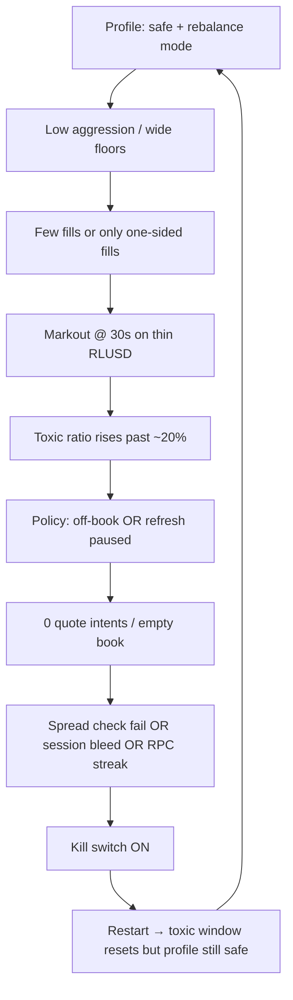

# Roadmap: Faster profile-driven decisions, less toxic dominance, longer clean data runs

> **Gate pass/fail numbers:** use **[05_MASTER_ROADMAP_REALISTIC_METRICS.md](05_MASTER_ROADMAP_REALISTIC_METRICS.md)**. This doc covers the defensive death spiral and kill/profile tactics.

**Date:** 2026-06-05  
**Audience:** Operator running ~250 XRP mainnet pilot on XRP/RLUSD  
**Problem statement (your words):**

- The bot **barely market-makes** (long stretches with no touch / no offers).
- **Toxic fills feel like they dominate** every run.
- You **cannot finish a long session** for good metrics because the **kill switch stops the engine**.
- You **want the kill switch** — this is risk capital — but you need **better decisions, faster**, using the **profile structure** you already built.

This roadmap is **action-first**: config you can apply tonight, then engineering in priority order. It complements [03_COMPETITIVE_MARKET_MAKER_ROADMAP.md](03_COMPETITIVE_MARKET_MAKER_ROADMAP.md) but focuses on **breaking the defensive death spiral**, not abstract “field MM” theory.

---

## 1. What is actually happening (root cause, not bad luck)

You are caught in a **feedback loop** the codebase intentionally built for Gate 1 survival:



### 1.1 Why it barely MMs

| Mechanism | `safe` (typical pilot) | Effect |
|-----------|------------------------|--------|
| `inventory_mode` | **`rebalance`** (GUI preset) | Dynamic policy uses **inventory-driven touch**, not competitive MM (`dynamic_quoting_policy.py` → `mm_mode=False` path) |
| `aggression` | **0.50** | Relevance factor stays low → **near-touch / off-book** |
| `min_spread_floor_pct` | **0.16%** | L1 rarely competitive on tight RLUSD book |
| `dynamic_min_edge_enabled` | **false** (preset) | Less adaptive when book is tight |
| Toxic @ **≥8 fills** | **20%** → off-book latch | One bad streak → **no touch for many cycles** |
| `toxic_refresh_pause_ratio` | **22%** | Stops refresh when book empty → **no storefront** |
| Poll interval | **20s** | “Faster” is relative; decisions lag fast tape |

**Important:** The bot is doing what `safe` was designed to do — **not get picked off**. That is the opposite of “stay at touch and collect data.”

### 1.2 Why toxic “dominates” even when `toxic_fill_kill_enabled: false`

Toxic ratio **does not need the kill switch** to ruin a run:

1. **`FillQualityTracker`** marks a fill toxic if mid moves **> ~4%** against you within **30s** (`markout_toxic_threshold_pct` on profile).
2. On **thin RLUSD**, a **0.15–0.4%** move in 30s is common — but threshold is **4%** per move; smaller repeated adverse moves still hurt the **rolling score** and sizing multipliers.
3. After **8 fills**, `effective_toxic_ratio()` drives **`toxic_off_touch_active`** → posture **`off`** (no join touch).
4. GUI hero metric **“Toxic @30s”** can look scary with **3–12 fills** (small sample).

So you feel “all toxic” while the engine is **defending you into silence**.

### 1.3 What is actually killing your sessions (checklist)

Read `logs/kill_switch.json` after each stop. Typical killers on pilot:

| Kill reason | Default trigger | Why it hits data runs |
|-------------|-----------------|------------------------|
| **Session balance PnL** | **−0.35 XRP** after **≥25 fills** | Real on thin book — a few bad fills + fees ends the run early |
| **Spread check failed N cycles** | **8** consecutive failures | Bad RPC book **or** quotes too wide vs touch → no valid intents |
| **Daily drawdown %** | ~3.5% of portfolio mark | Usually fixed post v1.4.3; still check if mid was bad |
| **RPC failure streak** | **6** cycles | Cluster / node issues |
| **Toxic fill ratio kill** | **OFF** by default | Only if you enabled it in Advanced |

**Not the main enemy if defaults:** `toxic_fill_kill_enabled` (false).

---

## 2. Design principle: two operating modes (same code, different profile + kills)

Keep **one codebase**. Split **operator intent** explicitly:

| Mode | Goal | Kill posture | Profile |
|------|------|--------------|---------|
| **A — Data run** | ≥50–100 fills, learn book, tune toxicity | **Looser session kill**, spread-kill only on **reliable** book failures | `tight_spread` or new **`data_pilot`** |
| **B — Capital guard** | Don’t bleed wallet overnight | **Tighter** session + drawdown kills | `safe` |

You are trying to get **Mode A** results while running **Mode B** config. That mismatch is the core issue.

**Rule:** Never judge toxicity or spread capture on a run that ended at fill #12 with kill active.

---

## 3. Profile playbook — use structure on purpose

Profiles already own: spread multipliers, toxicity enter/exit, poll/refresh cadence, execution tolerances, min edge. **Apply profile in GUI** (not only `active_profile` in YAML) so preset fields sync.

### 3.1 Stop using `safe` for data collection

| Setting | `safe` (Gate 1) | **`tight_spread` (Gate 2 / data)** |
|---------|-----------------|-------------------------------------|
| Purpose | Survive, prove plumbing | **Actually quote the book** |
| `inventory_mode` | rebalance | **market_make** |
| `base_spread` (preset) | 0.10% | **0.06%** |
| `dynamic_min_edge_enabled` | off | **on** |
| `aggression` (profile) | 0.50 | **0.72** |
| `toxic_no_touch` | 20% enter / 15% exit | tune in Gate 2 (see §4) |
| Poll | 20s | **15s** |

**Action:** GUI → select **`tight_spread`** → **Apply profile** → Save config → **Restart engine** (baselines + drawdown day start).

### 3.2 Proposed fourth pilot profile: `data_pilot` (engineering — Tier 2.5)

Add a built-in profile between `tight_spread` and `safe` for **long metric runs**:

| Field | Suggested value | Rationale |
|-------|-----------------|-----------|
| `aggression` | 0.68 | More touch time than safe, less than profit_mode |
| `toxic_min_fills_for_gates` | **12** | Ignore toxicity gates until meaningful sample |
| `toxic_no_touch_ratio` | **0.28** enter / **0.20** exit | Wider hysteresis — don’t empty book on noise |
| `toxic_refresh_pause_ratio` | **0.35** | Pause refresh later |
| `markout_toxic_threshold_pct` | **0.06** | 6% move @30s = toxic (RLUSD is jumpy; 4% may be OK — test) |
| `book_poll_interval_seconds` | **12** | Faster reaction without WebSocket |
| `min_spread_floor_pct` | 0.10 | Competitive but not profit_mode |
| `inventory_mode` preset | market_make | True MM loop |

Until this exists in code, **`tight_spread` + §4 config overrides** is your stand-in.

### 3.3 Profile decision tree (each cycle — what you should see in ticker)

```
START
  ├─ Book crossed / bad mid? → PAUSE live (no kill streak) — wait
  ├─ Kill active? → FLAT (cancel offers if needed)
  ├─ Hostile market assessment? → spread_mid or off (profile-specific)
  ├─ Toxic ≥ gate AND fills ≥ min_gate_fills?
  │     ├─ YES → off-book OR refresh pause (NOT necessarily kill)
  │     └─ NO  → continue
  ├─ market_edge_met false? → shrink / no join touch (Tier 2.5: block live)
  ├─ Inventory >12% off 55% XRP? → skew + maybe pause one side
  └─ Favorable/neutral + edge met → at_touch or near_touch + join_touch
```

**Faster decisions** = pick a profile whose tree **spends more time in the last branch**, not rewriting the engine.

---

## 4. Kill switch tuning for longer data runs (keep safety)

Apply in **GUI → Advanced → Kill settings** and `config.yaml`. These preserve **real** kills while stopping **nuisance** stops.

### 4.1 Recommended “data run” kill matrix

| Parameter | Capital guard (`safe`) | **Data run (`tight_spread`)** | Notes |
|-----------|------------------------|-------------------------------|-------|
| `session_balance_loss_kill_xrp` | 0.35 | **0.65 – 1.0** | −0.35 on ~250 XRP is **0.14%** — one bad hour trips it |
| `session_balance_loss_kill_min_fills` | 25 | **40 – 50** | Need sample before session kill |
| `spread_failure_kill_cycles` | 8 | **12 – 15** | v1.4.4 already skips streak on `book_unreliable` |
| `max_daily_drawdown_percent` | 3.5 | **3.5** (keep) | Real protection |
| `toxic_fill_kill_enabled` | false | **false** (keep) | Let policy handle toxicity |
| `rpc_failure_kill_streak` | 6 | **8** | Fewer node blips stop science |
| `toxic_fill_ratio_kill_threshold` | 0.75 | n/a if disabled | Do not enable until Gate 2 passed |

**Hard rule:** After **clear kill + restart engine**, session baseline and drawdown day start reset. Clearing kill **without** restart leaves stale session PnL logic.

### 4.2 What to keep strict (non-negotiable)

- **Daily drawdown kill** on valid mid only.
- **Spread validation** before live submit (`require_spread_validation_for_live: true`).
- **Manual `profit_mode`** only.
- **Stop engine ≠ cancel offers** — cancel when pausing for the night.

### 4.3 Session autopsy (5 minutes after every kill)

```powershell
cd C:\Users\micha\xledgermate
type logs\kill_switch.json
python scripts\analyze_session.py
python scripts\weekly_skim_report.py
```

Log in a notebook: **kill reason | fills at kill | balance PnL | toxic % | last 5 decision lines**.

---

## 5. Toxic fill strategy — signal vs noise

### 5.1 What to trust

| Metric | Trust when | Ignore when |
|--------|------------|-------------|
| **Balance session PnL** | Always (primary) | N/A |
| **Toxic ratio (rolling)** | **≥ 25 fills**, stable book | **< 12 fills** |
| **Toxic @30s (GUI)** | Fills ≥ 3 and book OK | Engine just restarted |
| **Spread capture XRP** | Ledger-sourced fills | balance_delta only rows |
| **MTM session PnL** | Book trustworthy | Crossed / inverted book |

### 5.2 Operator responses (no code)

| Observation | Action |
|-------------|--------|
| Toxic high, balance PnL **≥ 0** | Profile too defensive OR markout too sensitive — **widen toxic enter**, don’t stop engine |
| Toxic high, balance PnL **< 0** | Step down to `safe` **or** pause; review one-sided inventory |
| 0 intents, toxic moderate | You are **off-book by policy** — switch `tight_spread` + market_make |
| Spread kill | Open `decisions.jsonl` — real misquote vs bad book |
| Session kill at 25 fills | Raise min fills or loss limit (§4) |

### 5.3 Engineering fixes that reduce “false toxic dominance”

Priority for your pain:

| # | Change | File(s) | Outcome |
|---|--------|---------|---------|
| **T1** | **`data_pilot` profile** + GUI preset | `core/perception.py`, `utils/gui_profile_presets.py` | Longer runs without loosening `safe` globally |
| **T2** | **Persist fill-quality window** across engine restart (optional 50% decay) | `FillQualityTracker`, runtime_state | Restart doesn’t instantly re-panic |
| **T3** | **Block live quotes when `market_edge_met` false** | `trading_engine.py`, `quote_decision.py` | Fewer structurally bad fills |
| **T4** | **BookOffers ask inversion fix** | `xrpl_connector.py` | Fewer spread-fail cycles + bogus mids |
| **T5** | **Ledger-first fill PnL** in CSV | `monitoring/ledger_fills.py`, `_log_fill` | Scoreboard matches reality |
| **T6** | **Faster poll profile knob** `book_poll_interval_seconds: 12` on data profile | `profile_execution.py` | Decisions track book sooner |

---

## 6. Faster decisions — concrete levers (profiles + config)

“Faster” on XRPL means **shorter cycle latency** + **less time in off-book**, not HFT.

### 6.1 Per-profile speed knobs (already in code)

| Knob | Location | `safe` | `tight_spread` | Target for data |
|------|----------|--------|----------------|-----------------|
| `book_poll_interval_seconds` | Profile | 20 | 15 | **12** (new profile) |
| `full_quote_refresh_seconds` | Profile | 60 | 60 | 45 |
| `mid_requote_trigger_pct` | Derived from aggression | ~0.14% | ~0.11% | Lower = refresh sooner on move |
| `order_keep_price_tolerance_pct` | Profile | 0.12 | 0.10 | Slightly tighter = follow touch |
| Auto profile switch | `market_conditions.py` | Can drop to defensive | **Cooldown 30+ min** during data run |

**Action:** Disable aggressive auto-downgrade during Gate 2 week: stay on `tight_spread` unless **manual** switch.

### 6.2 Decision pipeline order (already correct — don’t bypass)

The engine already stacks decisions in the right priority (`trading_engine._run_cycle`):

1. Book trust → 2. Kill/drawdown → 3. Fills/markout → 4. Market assessment → 5. Inventory → 6. **Dynamic quoting policy** → 7. Spread validation → 8. Order sync.

**Faster/better** = change **inputs to step 6** (profile + assessment), not skip step 7.

### 6.3 GUI / operator habits for speed

- Watch **marquee policy line** (`at_touch` vs `off-book`) — if off-book > 70% of cycles, wrong profile.
- **Sync risk capital to live portfolio** every session — wrong cap → wrong sizes → weird fills.
- **L1 only** for data: `order_sizes: [12, 0, 0]` (example for ~250 XRP).
- **`trading_enabled: true`**, **`dry_run: false`** only when spread check passes in dry-run once cycle.

---

## 7. Phased roadmap (4 weeks)

### Week 0 — Tonight (no code)

- [ ] Read `logs/kill_switch.json` from last 3 stops — classify killer.
- [ ] Switch to **`tight_spread`**, Apply profile, **market_make**.
- [ ] Set data-run kills (§4.1).
- [ ] Clear kill → **Restart engine** → run **4-hour block**.
- [ ] Target: **≥30 fills**, do not change profile mid-run.

**Success:** Kill reason understood; ≥30 fills OR clean stop with notes.

### Week 1 — Profile discipline + metrics

- [ ] Three sessions ≥40 fills each, same config.
- [ ] Weekly skim report after each.
- [ ] Track: % cycles with `at_touch|near_touch` in decisions, cancel/fill, balance PnL.
- [ ] If toxic > 25% but balance PnL ≥ 0: **raise toxic enter to 25%** via profile request (manual YAML) until `data_pilot` exists.

**Success:** One uninterrupted **≥50-fill** session.

### Week 2 — Engineering Tier T1–T3

- [ ] Implement **`data_pilot`** profile + preset.
- [ ] `market_edge_met` live gate.
- [ ] Optional: persist fill-quality with decay.

**Success:** **≥80 fills** without session kill; toxic gates fire later (≥12 fills).

### Week 3 — Book feed + economics truth

- [ ] BookOffers ask fix (T4).
- [ ] Ledger-first fill economics (T5).
- [ ] Re-run Gate 2 checklist from `docs/IMPLEMENTATION_PLAN.md`.

**Success:** Spread-capture bps reviewable; spread-fail kills rare.

### Week 4 — Competitive tuning (only if Week 1–3 green)

- [ ] Join-touch when favorable + edge met.
- [ ] Step L1 12 → 15 XRP if cancel/fill falling.
- [ ] Compare `data_pilot` vs `tight_spread` on same book hours.

**Success:** Gate 2 metrics trending: toxic < 20% / 50 fills, balance PnL ≥ 0 weekly.

---

## 8. Example `config.yaml` overlay for a data run

Copy only the kill + sizing section into your local `config/config.yaml` (adjust addresses separately):

```yaml
active_profile: tight_spread
inventory_mode: market_make
dynamic_min_edge_enabled: true

order_levels: 1
order_sizes: [12.0, 0.0, 0.0]
order_refresh_time_seconds: 45

# Data-run kills (still safe, not reckless)
session_balance_loss_kill_xrp: 0.85
session_balance_loss_kill_min_fills: 45
spread_failure_kill_cycles: 12
toxic_fill_kill_enabled: false
max_daily_drawdown_percent: 3.5
rpc_failure_kill_streak: 8
```

Sync **risk capital** to live portfolio in GUI after save.

---

## 9. What success looks like (realistic)

| Timeframe | You should see |
|-----------|----------------|
| After Week 0 | Offers on book most cycles; kills rare and explained |
| After Week 1 | ≥50-fill session completed; toxic metric noisy but **balance PnL** interpretable |
| After Week 2 | Toxic gates fire **after** 12 fills; fewer 0-intent streaks |
| After Week 4 | Gate 2 pass candidate: **100 fills**, toxic < 20% / 50, positive capture weeks |

You will **still** have toxic fills — MM on RLUSD **is** adverse selection management. Success is **toxic not driving policy into silence** and **kills only on real bleed**.

---

## 10. Code implementation backlog (for dev — ordered for your issue)

| Priority | Task | Est. |
|----------|------|------|
| P0 | `data_pilot` profile + GUI preset + docs | 0.5 day |
| P0 | Document “data run” kill defaults in `config.example.yaml` | 1 hr |
| P1 | `market_edge_met` blocks `place_quote` | 0.5 day |
| P1 | BookOffers ask inversion | 1–2 days |
| P2 | Fill-quality persist + decay on restart | 1 day |
| P2 | `book_poll_interval_seconds` min 10 on aggressive profiles | 2 hr |
| P3 | Auto-profile “lock” flag for data sessions | 0.5 day |
| P3 | Stop-engine option: cancel all offers | 2 hr |

---

## 11. Related files in this folder

| Doc | Use |
|-----|-----|
| [02_HOW_IT_WORKS_AND_IMPROVEMENTS.md](02_HOW_IT_WORKS_AND_IMPROVEMENTS.md) | Cycle + improvement list |
| [03_COMPETITIVE_MARKET_MAKER_ROADMAP.md](03_COMPETITIVE_MARKET_MAKER_ROADMAP.md) | Gate 2 / field MM |
| [01_FULL_STACK_CODE_AUDIT.md](01_FULL_STACK_CODE_AUDIT.md) | Code risks |
| `docs/IMPLEMENTATION_PLAN.md` | Official gates |
| `docs/OPERATOR_MANUAL.md` | GUI procedures |

---

*This roadmap assumes v1.4.4+ on `tier-2-polish`. If kills persist after §4 + `tight_spread`, paste `kill_switch.json` + last 30 lines of `logs/decisions.jsonl` into the next session for a run-specific triage.*